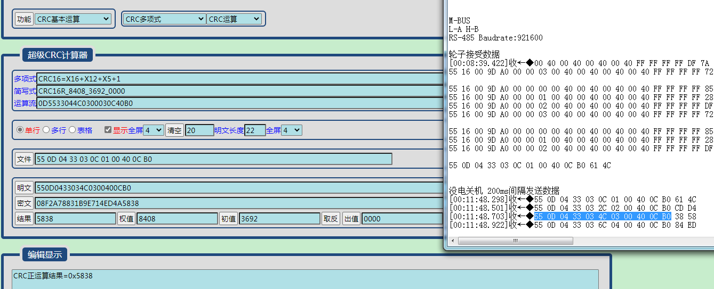

## 硬件方案

M-BUS
L-A H-B
RS-485 Baudrate:921600

## 协议

55 16 00 9D A0 00 40 00 00 40 00 40 00 40 00 40 FF FF FF FF EA 32

55：帧头
16: 整段数据长度:0x16 = 22 [55-32]
00: reserve
9D: 命令
A0: reserve
00: reserve
40：

FF FF FF FF: reserve
EA 32: CRC16校验




## 编址

#### process:
主机循环请求发送，从机通过转动轮子来触发数据回复，从机回复后主机继续请求下一个轮子，最后主机发送奇怪的xx表示结束

#### 主机发送：
[00-03]
55 16 00 9D A0 00 40 00 00 40 00 40 00 40 00 40 FF FF FF FF EA 32
55 16 00 9D A0 00 40 01 00 40 00 40 00 40 00 40 FF FF FF FF 47 37
55 16 00 9D A0 00 40 02 00 40 00 40 00 40 00 40 FF FF FF FF B0 39
55 16 00 9D A0 00 40 03 00 40 00 40 00 40 00 40 FF FF FF FF 1D 3C
#### 从机回复：
[00-03]
55 20 00 1A A0 01 00 00 2A 26 E9 00 81 01 B8 00 00 00 43 01 12 01 DE 02 9C 12 00 00 00 00 D4 87
55 20 00 1A A0 01 01 00 0E 27 6A 00 7A 01 AE 00 00 00 3E 01 12 01 22 02 99 12 00 00 00 00 9D C9
55 20 00 1A A0 01 02 00 C8 25 B2 00 78 01 A4 00 00 00 2F 01 12 01 31 02 99 12 00 00 00 00 07 B3 
55 20 00 1A A0 01 03 00 93 26 72 FF 81 01 B2 00 00 00 4D 01 12 01 91 02 99 12 00 00 00 00 78 59

#### 最后的从机完成后：
55 0E 04 66 28 0C 03 00 40 00 32 11 82 E5 
55 25 04 84 0C 28 03 00 C0 00 32 00 01 E3 07 07 15 08 2F 07 0E 31 34 56 4B 47 36 57 30 32 34 30 31 44 41 B5 24

```
## 1  右上角编址
55 16 00 9D A0 00 40 00 00 40 00 40 00 40 00 40 FF FF FF FF EA 32 
55 16 00 9D A0 00 40 00 00 40 00 40 00 40 00 40 FF FF FF FF EA 32
55 20 00 1A A0 01 00 00 2A 26 E9 00 81 01 B8 00 00 00 43 01 12 01 DE 02 9C 12 00 00 00 00 D4 87 
55 16 00 9D A0 00 40 01 00 40 00 40 00 40 00 40 FF FF FF FF 47 37 
55 16 00 9D A0 00 40 01 00 40 00 40 00 40 00 40 FF FF FF FF 47 37 
55 16 00 9D A0 00 40 01 00 40 00 40 00 40 00 40 FF FF FF FF 47 37


## 2 左上编址
55 16 00 9D A0 00 40 01 00 40 00 40 00 40 00 40 FF FF FF FF 47 37
55 16 00 9D A0 00 40 01 00 40 00 40 00 40 00 40 FF FF FF FF 47 37 
55 16 00 9D A0 00 40 01 00 40 00 40 00 40 00 40 FF FF FF FF 47 37 
55 20 00 1A A0 01 01 00 0E 27 6A 00 7A 01 AE 00 00 00 3E 01 12 01 22 02 99 12 00 00 00 00 9D C9 
55 16 00 9D A0 00 40 02 00 40 00 40 00 40 00 40 FF FF FF FF B0 39 
55 16 00 9D A0 00 40 02 00 40 00 40 00 40 00 40 FF FF FF FF B0 39 
55 16 00 9D A0 00 40 02 00 40 00 40 00 40 00 40 FF FF FF FF B0 39 
55 16 00 9D A0 00 40 02 00 40 00 40 00 40 00 40 FF FF FF FF B0 39

## 3 左下编址
55 16 00 9D A0 00 40 02 00 40 00 40 00 40 00 40 FF FF FF FF B0 39 
55 16 00 9D A0 00 40 02 00 40 00 40 00 40 00 40 FF FF FF FF B0 39 
55 16 00 9D A0 00 40 02 00 40 00 40 00 40 00 40 FF FF FF FF B0 39 
55 16 00 9D A0 00 40 02 00 40 00 40 00 40 00 40 FF FF FF FF B0 39 
55 20 00 1A A0 01 02 00 C8 25 B2 00 78 01 A4 00 00 00 2F 01 12 01 31 02 99 12 00 00 00 00 07 B3 
55 16 00 9D A0 00 40 03 00 40 00 40 00 40 00 40 FF FF FF FF 1D 3C 
55 16 00 9D A0 00 40 03 00 40 00 40 00 40 00 40 FF FF FF FF 1D 3C

## 4 右下编址

55 16 00 9D A0 00 40 03 00 40 00 40 00 40 00 40 FF FF FF FF 1D 3C 
55 16 00 9D A0 00 40 03 00 40 00 40 00 40 00 40 FF FF FF FF 1D 3C 
55 16 00 9D A0 00 40 03 00 40 00 40 00 40 00 40 FF FF FF FF 1D 3C 
55 20 00 1A A0 01 03 00 93 26 72 FF 81 01 B2 00 00 00 4D 01 12 01 91 02 99 12 00 00 00 00 78 59 
55 0E 04 66 28 0C 03 00 40 00 32 11 82 E5 
55 25 04 84 0C 28 03 00 C0 00 32 00 01 E3 07 07 15 08 2F 07 0E 31 34 56 4B 47 36 57 30 32 34 30 31 44 41 B5 24

```
